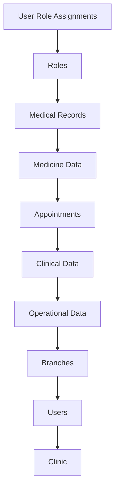

# Comprehensive Clinic Deletion System

## Overview

The platform now includes a comprehensive clinic deletion system that safely removes all clinic-related data when a clinic is deleted from the super admin panel. This ensures complete data cleanup and prevents orphaned records.

## Features

### 🔒 Security
- **Super Admin Only**: Only platform super admins can delete clinics
- **Confirmation Required**: Multi-step confirmation process with detailed warnings
- **Non-reversible**: Clear warnings that deletion cannot be undone

### 📊 Comprehensive Data Removal
When a clinic is deleted, the system removes ALL related data in the following order:

1. **User Role Assignments** - All RBAC assignments for the clinic
2. **Roles** - All custom roles created for the clinic
3. **Medical Records Data**:
   - Medical report responses
   - Patient note entries
   - Patient notes
   - Medical report fields
   - Notes sections
4. **Medicine Management Data**:
   - Stock transactions
   - Purchase orders
   - Medicine stock records
   - Suppliers
   - Medicines
   - Medicine categories
   - Medicine brands
5. **Clinical Data**:
   - Appointments
   - Appointment types
   - Doctor specialities
   - Patients
   - Doctors
6. **Operational Data**:
   - Visitors
   - Call logs
   - Clinic settings
   - Invitations
7. **Infrastructure**:
   - Branches
   - Users
   - Clinic document

### 🚀 Performance & Reliability
- **Batch Processing**: Uses Firestore batch writes for efficient deletion
- **Error Handling**: Comprehensive error handling with rollback capabilities
- **Progress Tracking**: Real-time progress updates during deletion
- **Results Summary**: Detailed report of what was deleted
- **Persistent Notifications**: Toast notifications that persist across page navigation
- **Visual Progress Indicator**: In-page deletion progress indicator in admin layout

## Usage

### From Super Admin Panel

1. Navigate to **Admin > Clinics**
2. Find the clinic to delete
3. Click the **Delete** button
4. Review the clinic details and warnings
5. Confirm deletion
6. **Monitor progress via:**
   - **Persistent toast notifications** (show every 3 seconds)
   - **In-page progress indicator** (visible on all admin pages)
   - **Navigation freedom** (switch between pages without losing progress)
7. **Automatic completion notification** with deletion summary

### Programmatic Usage

```typescript
import { clinicService } from '@/services/clinicService';

// Comprehensive deletion (recommended)
const result = await clinicService.deleteClinicWithAllData(clinicId);
console.log('Deleted items:', result.deletedCounts);

// Simple deletion (deprecated - only deletes clinic document)
await clinicService.deleteClinic(clinicId);
```

## Data Deletion Order

The system deletes data in a specific order to maintain referential integrity:



## Security Considerations

- **Authorization**: Only super admins can perform deletions
- **Audit Trail**: All deletion operations are logged
- **No Recovery**: Once deleted, data cannot be recovered
- **Session Management**: Maintains admin session during deletion process

## Error Handling

The system includes comprehensive error handling:

- **Permission Errors**: Clear messages for unauthorized access
- **Network Errors**: Retry logic for network issues
- **Partial Failures**: Reports which data was successfully deleted
- **Timeout Handling**: Prevents hanging operations

## Monitoring & Logging

All deletion operations are logged with:
- Timestamp
- Admin user who performed the deletion
- Clinic details
- Number of records deleted by type
- Completion status

## Best Practices

### Before Deletion
1. **Backup Important Data**: Export any data that might be needed later
2. **Notify Stakeholders**: Inform relevant parties before deletion
3. **Verify Clinic Status**: Ensure the clinic should actually be deleted
4. **Check Dependencies**: Verify no critical integrations depend on the clinic

### During Deletion
1. **Monitor Progress**: Watch the deletion progress for any issues
2. **Don't Interrupt**: Allow the process to complete fully
3. **Check Results**: Review the deletion summary

### After Deletion
1. **Verify Cleanup**: Confirm all expected data was removed
2. **Update Systems**: Update any external systems that referenced the clinic
3. **Document Action**: Record the deletion for audit purposes

## Troubleshooting

### Common Issues

**"Access denied" Error**
- Ensure you're logged in as a super admin
- Check your user permissions
- Verify Firestore security rules allow super admin operations

**"Missing or insufficient permissions" Error**
- This indicates Firestore security rules are blocking the operation
- Ensure all collection rules include `isSuperAdmin()` permissions
- Check that collection names in the code match Firestore rules exactly

**"Clinic not found" Error**
- Verify the clinic ID is correct
- Ensure the clinic hasn't already been deleted

**Partial Deletion**
- Check the deletion summary for which data was removed
- Review browser console for specific collection errors
- Some collections may be empty (shows 0 deleted)

**Timeout Errors**
- Large clinics may take longer to delete
- The process will continue in the background
- Check the deletion summary after a few minutes

**Collection Name Mismatches**
- Ensure collection names in code match Firestore security rules
- Some collections use camelCase (e.g., `patientNotes`)
- Others use snake_case (e.g., `medical_report_fields`)

## Recovery

**Important**: There is no automated recovery system. Once a clinic is deleted, the data cannot be restored through the application.

For data recovery:
1. Restore from database backups (if available)
2. Contact system administrators
3. Recreate the clinic and re-enter data manually

## Persistent Progress Features

### 🔔 Toast Notifications
- **Automatic Updates**: Progress toasts appear every 3 seconds
- **Cross-Page Persistence**: Toasts continue showing when navigating between admin pages
- **Status Indicators**: Different emojis and colors for different stages
- **Completion Summary**: Final toast shows total records deleted and time taken

### 📊 In-Page Progress Indicator
- **Global Visibility**: Shows on all admin pages during deletion
- **Real-time Updates**: Live progress text and animated spinner
- **Time Tracking**: Shows elapsed time since deletion started
- **Results Preview**: Displays deletion summary as data is removed

### 🚀 Navigation Freedom
- **No Interruption**: Users can freely navigate between admin pages
- **State Persistence**: Deletion progress maintained across page changes
- **Background Processing**: Deletion continues even when navigating away
- **Automatic Updates**: Progress updates continue regardless of current page

## Technical Details

### Batch Size Limits
- Maximum 500 operations per Firestore batch
- Automatic batch management for large datasets

### Performance Metrics
- Small clinics (< 1000 records): ~30 seconds
- Medium clinics (1000-10000 records): ~2-5 minutes
- Large clinics (> 10000 records): ~5-15 minutes

### Context Management
- **Global State**: `DeletionProgressContext` manages deletion state
- **Automatic Cleanup**: Context clears state after completion/failure
- **Memory Efficient**: Minimal state storage with automatic intervals

### Collection Names
The system operates on these Firestore collections:
- `user_role_assignments`
- `roles`
- `medicalReportResponses` (camelCase)
- `patientNoteEntries` (camelCase)
- `patientNotes` (camelCase)
- `medical_report_fields`
- `notes_sections`
- `stockTransactions` (camelCase)
- `medicineStock` (camelCase)
- `suppliers`
- `medicines`
- `medicineCategories` (camelCase)
- `medicineBrands` (camelCase)
- `appointments`
- `appointment_types`
- `doctor_specialities`
- `patient_contacts`
- `patients`
- `doctors`
- `visitors`
- `callLogs` (camelCase)
- `clinicSettings` (camelCase)
- `invitations`
- `branches`
- `users`
- `clinics`

**Note**: Collection names follow the project's naming convention (mix of camelCase and snake_case) 